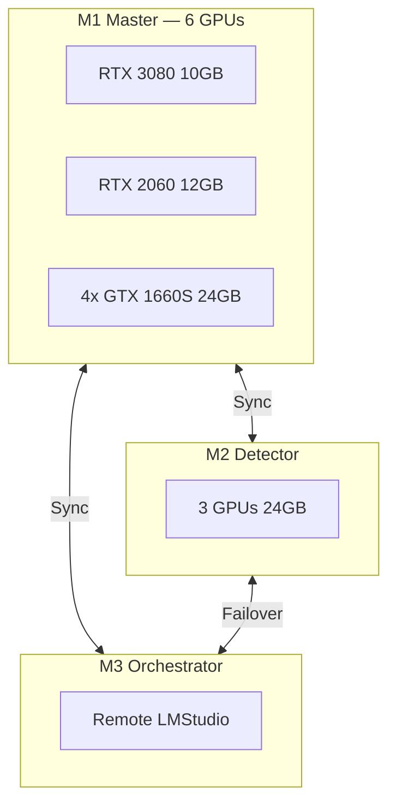

```
     ██╗ █████╗ ██████╗ ██╗   ██╗██╗███████╗
     ██║██╔══██╗██╔══██╗██║   ██║██║██╔════╝
     ██║███████║██████╔╝██║   ██║██║███████╗
██   ██║██╔══██║██╔══██╗╚██╗ ██╔╝██║╚════██║
╚█████╔╝██║  ██║██║  ██║ ╚████╔╝ ██║███████║
 ╚════╝ ╚═╝  ╚═╝╚═╝  ╚═╝  ╚═══╝  ╚═╝╚══════╝
           C  L  U  S  T  E  R
    Orchestration Multi-GPU Distribuee
```

<p align="center">
  
  
  
  
  
  
</p>

<p align="center">
  <strong>Systeme d'orchestration IA distribue multi-GPU et multi-noeuds.<br/>
  Dispatch engine 9 etapes, quality gates 6 axes, consensus multi-modele,<br/>
  failover en cascade, auto-amelioration et monitoring thermique GPU.</strong>
</p>

---


## Cluster Architecture



## Table des matieres

- [Presentation](#presentation)
- [Architecture du cluster](#architecture-du-cluster)
- [Noeuds du cluster](#noeuds-du-cluster)
- [Pipeline de dispatch (9 etapes)](#pipeline-de-dispatch-9-etapes)
- [Quality Gates (6 axes)](#quality-gates-6-axes)
- [Cascade de failover](#cascade-de-failover)
- [Consensus multi-modele](#consensus-multi-modele)
- [Auto-amelioration](#auto-amelioration)
- [Containers Docker (10)](#containers-docker-10)
- [Reseau Docker](#reseau-docker)
- [Timers systemd (5)](#timers-systemd-5)
- [Matrice de routage (17 domaines)](#matrice-de-routage-17-domaines)
- [Arborescence du depot](#arborescence-du-depot)
- [Installation](#installation)
- [Commandes jarvis-ctl](#commandes-jarvis-ctl)
- [Monitoring thermique GPU](#monitoring-thermique-gpu)
- [Depannage](#depannage)
- [Licence](#licence)

---

## Presentation

**JARVIS Cluster** est le systeme d'orchestration IA distribue multi-GPU et multi-noeuds. Ce depot contient l'infrastructure cluster, le moteur de dispatch, le vote par consensus et l'orchestration multi-modele.

Le systeme repartit intelligemment les requetes sur un parc de GPUs heterogenes en tenant compte de la charge, de la latence, de la temperature et de la specialisation de chaque noeud — avec failover automatique et circuit breaker integres.

---

## Architecture du cluster

```
+=====================================================================+
|                        JARVIS CLUSTER                               |
|                                                                     |
|  +---------------------------------------------------------------+  |
|  |                    DISPATCH ENGINE                             |  |
|  |  health --> classify --> memory --> optimize --> route          |  |
|  |       --> dispatch --> quality gates --> feedback --> events    |  |
|  +-----------------------------+---------------------------------+  |
|                                |                                    |
|            +-------------------+-------------------+                |
|            |                   |                   |                |
|            v                   v                   v                |
|     +-----------+      +-----------+       +-----------+           |
|     | M1 (local)|      | M2 (LAN)  |       | M3 (LAN)  |          |
|     | 5 GPUs    |      | fast      |       | general   |          |
|     | 40GB VRAM |      | inference |       | inference |          |
|     | deep      |      |           |       | reasoning |          |
|     | analysis  |      |           |       | fallback  |          |
|     +-----------+      +-----------+       +-----------+           |
|            |                                                        |
|            v                                                        |
|     +-----------+      +-----------+       +-----------+           |
|     | OL1       |      | GEMINI    |       | CLAUDE    |           |
|     | (Ollama)  |      | (API)     |       | (API)     |           |
|     | cloud     |      | fallback  |       | fallback  |           |
|     | inference |      |           |       |           |           |
|     +-----------+      +-----------+       +-----------+           |
|                                                                     |
|  +---------------------------------------------------------------+  |
|  |            CIRCUIT BREAKER (par noeud)                         |  |
|  |          3 echecs --> skip 60s --> retry auto                  |  |
|  +---------------------------------------------------------------+  |
|                                                                     |
|  +---------------------------------------------------------------+  |
|  |         LOAD BALANCER (scoring par noeud)                      |  |
|  |       Routage adaptatif : latence + score qualite              |  |
|  +---------------------------------------------------------------+  |
+=====================================================================+
```

---

## Noeuds du cluster

| Noeud | Adresse | Role | GPUs | VRAM |
|-------|---------|------|------|------|
| **M1** "La Creatrice" | `127.0.0.1:1234` | `deep_analysis` | RTX 3080 (10GB), RTX 2060 (12GB), 3x GTX 1660 SUPER (6GB) | **40 GB** |
| **M2** | `192.168.1.26:1234` | `fast_inference` | — | — |
| **M3** | `192.168.1.113:1234` | `general_inference` (reasoning fallback) | — | — |
| **OL1** | `127.0.0.1:11434` | `cloud_inference` (Ollama) | — | — |

### Specifications M1

| Composant | Detail |
|-----------|--------|
| CPU | AMD Ryzen 7 5700X3D — 16 threads |
| RAM | 46 GB DDR4 + 12 GB ZRAM |
| GPU 0 | NVIDIA RTX 3080 — 10 GB GDDR6X |
| GPU 1 | NVIDIA RTX 2060 — 12 GB GDDR6 |
| GPU 2 | NVIDIA GTX 1660 SUPER — 6 GB GDDR6 |
| GPU 3 | NVIDIA GTX 1660 SUPER — 6 GB GDDR6 |
| GPU 4 | NVIDIA GTX 1660 SUPER — 6 GB GDDR6 |
| **VRAM totale** | **40 GB** |

---

## Pipeline de dispatch (9 etapes)

Chaque requete traverse un pipeline complet en 9 etapes sequentielles :

```
  +===============+
  | 1. HEALTH     |  Verification sante de tous les noeuds
  |    CHECK      |  (latence, GPU temp, disponibilite)
  +======+========+
         |
         v
  +===============+
  | 2. CLASSIFY   |  Classification du domaine de la requete
  |               |  (17 domaines de routage)
  +======+========+
         |
         v
  +===============+
  | 3. MEMORY     |  Enrichissement via memoire contextuelle
  |  ENRICHMENT   |  (historique, patterns, preferences)
  +======+========+
         |
         v
  +===============+
  | 4. PROMPT     |  Optimisation du prompt avant envoi
  |  OPTIMIZE     |  (reformulation, ajout contexte)
  +======+========+
         |
         v
  +===============+
  | 5. ROUTE      |  Selection du noeud optimal
  |               |  (score, latence, specialisation)
  +======+========+
         |
         v
  +===============+
  | 6. DISPATCH   |  Envoi au noeud selectionne
  |               |  (avec timeout et retry)
  +======+========+
         |
         v
  +===============+
  | 7. QUALITY    |  Validation sur 6 axes
  |    GATES      |  (longueur, structure, pertinence,
  |               |   confiance, latence, hallucination)
  +======+========+
         |
         v
  +===============+
  | 8. FEEDBACK   |  Boucle de retour
  |               |  (scoring, apprentissage, ajustement)
  +======+========+
         |
         v
  +===============+
  | 9. EVENT      |  Diffusion sur le bus d'evenements
  |    STREAM     |  (WebSocket, logs, metriques)
  +===============+
```

---

## Quality Gates (6 axes)

Chaque reponse est evaluee sur 6 axes avant d'etre validee :

| Axe | Description |
|-----|-------------|
| **Longueur** | La reponse respecte la taille attendue |
| **Structure** | Format coherent (markdown, listes, code) |
| **Pertinence** | Adequation avec la requete originale |
| **Confiance** | Score de confiance du modele |
| **Latence** | Temps de reponse dans les seuils acceptables |
| **Hallucination** | Detection de contenu fabrique ou incoherent |

Si une reponse echoue aux quality gates, le dispatch engine relance la requete vers un autre noeud via la cascade de failover.

---

## Cascade de failover

En cas d'echec ou de quality gate non satisfait, les requetes suivent cette cascade :

```
  M1 --fail--> M2 --fail--> OL1 --fail--> M3 --fail--> GEMINI --fail--> CLAUDE
  |            |             |             |             |                |
  deep         fast          cloud         general       API              API
  analysis     inference     inference     inference     fallback         fallback
```

Le **circuit breaker** protege chaque noeud individuellement :
- **3 echecs consecutifs** : le noeud est mis en pause pendant **60 secondes**
- Apres le delai, le noeud est automatiquement remis en service
- Chaque noeud a son propre compteur independant

---

## Consensus multi-modele

Pour les requetes critiques, le systeme utilise un **vote pondere** entre plusieurs modeles :

```
  +---------+     +---------+     +---------+
  |   M1    |     |   M2    |     |   OL1   |
  |         |     |         |     |         |
  +----+----+     +----+----+     +----+----+
       |               |               |
       v               v               v
  +------------------------------------------+
  |         CONSENSUS ENGINE                  |
  |   Vote pondere M1 + M2 + OL1             |
  |   --> Reponse consolidee                  |
  +------------------------------------------+
```

Chaque noeud contribue avec un poids proportionnel a son score de fiabilite historique.

---

## Auto-amelioration

### 5 types d'auto-actions

Le systeme s'ameliore en continu via 5 mecanismes automatiques :

| Action | Description |
|--------|-------------|
| `route_shift` | Deplacement du routage vers un noeud plus performant |
| `temp_adjust` | Ajustement de la temperature du modele |
| `tokens_adjust` | Modification du nombre de tokens max |
| `gate_tune` | Affinage des seuils des quality gates |
| `prompt_enhance` | Amelioration automatique des prompts |

### Moteur de reflexion (5 axes)

Le systeme evalue sa propre performance sur 5 axes :

| Axe | Ce qu'il mesure |
|-----|-----------------|
| **Qualite** | Score moyen des quality gates |
| **Performance** | Latence et debit |
| **Fiabilite** | Taux de succes, uptime |
| **Efficience** | Utilisation des ressources GPU/RAM |
| **Croissance** | Evolution des patterns et apprentissage |

### Evolution des patterns

Le systeme detecte automatiquement les lacunes dans ses connaissances et cree de nouveaux patterns pour y repondre.

---

## Containers Docker (10)

| # | Container | Role | Port |
|---|-----------|------|------|
| 1 | `jarvis-ws` | Hub WebSocket FastAPI | `9742` |
| 2 | `vocal-engine` | Wake word + pipeline STT | — |
| 3 | `pipeline-engine` | Moteur de dispatch | — |
| 4 | `domino` | Actions apprises | — |
| 5 | `openclaw-node` | Gateway | `28789` |
| 6 | `cowork-engine` | 477 scripts autonomes | — |
| 7 | `cowork-dispatcher` | Routeur cowork | — |
| 8 | `vocal-whisper` | STT GPU (Whisper) | `18001` |
| 9 | `domino-mcp` | Bridge SSE | `8901` |
| 10 | `jarvis-telegram` | Bot Telegram distant | — |

---

## Reseau Docker

```
+======================== jarvis-network ==========================+
|                                                                   |
|  +--------------+   +--------------+   +--------------+          |
|  |  jarvis-ws   |<--|  pipeline-   |-->|  vocal-      |          |
|  |  :9742       |   |  engine      |   |  engine      |          |
|  +------+-------+   +------+-------+   +--------------+          |
|         |                  |                                      |
|         |           +------+-------+   +--------------+          |
|         |           |   domino     |   |  vocal-      |          |
|         |           |              |   |  whisper     |          |
|         |           +--------------+   |  :18001      |          |
|         |                              +--------------+          |
|         |                                                        |
|  +------+-------+   +--------------+   +--------------+          |
|  |  openclaw-   |   |  cowork-     |-->|  cowork-     |          |
|  |  node        |   |  dispatcher  |   |  engine      |          |
|  |  :28789      |   +--------------+   +--------------+          |
|  +--------------+                                                |
|                                                                   |
|  +--------------+   +--------------+                              |
|  |  domino-mcp  |   |  jarvis-     |                              |
|  |  :8901       |   |  telegram    |                              |
|  +--------------+   +--------------+                              |
|                                                                   |
+=================================================================+
```

---

## Timers systemd (5)

| Timer | Frequence | Role |
|-------|-----------|------|
| `jarvis-health` | Toutes les 15 min | Verification sante du cluster |
| `jarvis-backup` | Quotidien | Sauvegarde des donnees et configs |
| `jarvis-thermal` | Toutes les 5 min | Surveillance thermique GPU |
| `jarvis-log-rotate` | Hebdomadaire | Rotation des logs |
| `jarvis-pipeline-check` | Toutes les 10 min | Verification du pipeline de dispatch |

---

## Matrice de routage (17 domaines)

Le routeur adaptatif gere **17 domaines** pour diriger chaque requete vers le noeud le plus adapte, en tenant compte de :

- La specialisation du noeud pour le domaine
- La latence mesuree
- Le score de qualite historique
- La charge GPU actuelle
- La temperature GPU

---

## Arborescence du depot

```
JARVIS-CLUSTER/
|-- src/                    # Modules source
|-- canvas/                 # Interface UI avec proxy
|-- cowork/                 # Scripts autonomes
|-- docker/                 # Deploiement Docker
|-- electron/               # Application desktop
|-- scripts/                # Utilitaires cluster
|-- data/                   # Bases de donnees
|-- n8n_workflows/          # Automatisation workflows
|-- plugins/                # Plugins Claude Code
|-- projects/               # Deploiement Linux
|   +-- linux/
|       |-- install.sh          # Script d'installation
|       |-- docker-compose.yml  # Orchestration containers
|       +-- jarvis-ctl.sh       # Controle du cluster
|-- main.py                 # Point d'entree
|-- requirements.txt        # Dependances Python
|-- pyproject.toml          # Configuration projet
+-- README.md               # Ce fichier
```

---

## Installation

### Prerequis

- Linux (teste sur Ubuntu/Arch)
- Docker + Docker Compose
- NVIDIA drivers + NVIDIA Container Toolkit
- Python 3.11+
- Au moins 1 GPU NVIDIA

### Installation rapide

```bash
# Cloner le depot
git clone https://github.com/Turbo31150/JARVIS-CLUSTER.git
cd JARVIS-CLUSTER

# Lancer l'installation
bash projects/linux/install.sh
```

### Deploiement Docker

```bash
# Lancer tous les containers
cd projects/linux
docker compose up -d

# Verifier le statut
docker compose ps
```

### Controle avec jarvis-ctl

```bash
# Demarrer le cluster
bash projects/linux/jarvis-ctl.sh start

# Statut du cluster
bash projects/linux/jarvis-ctl.sh status

# Arreter le cluster
bash projects/linux/jarvis-ctl.sh stop
```

---

## Commandes jarvis-ctl

```bash
jarvis-ctl.sh start       # Demarrer tous les services
jarvis-ctl.sh stop        # Arreter tous les services
jarvis-ctl.sh restart     # Redemarrer
jarvis-ctl.sh status      # Etat du cluster
jarvis-ctl.sh logs        # Voir les logs
jarvis-ctl.sh health      # Check sante complet
```

---

## Monitoring thermique GPU

Le systeme surveille en continu la temperature des 5 GPUs de M1 :

| Seuil | Temperature | Action |
|-------|-------------|--------|
| Normal | < 75 C | Operation normale |
| Warning | >= 75 C | Alerte, reduction de charge |
| Critique | >= 85 C | Reroutage automatique vers un autre noeud |

Le timer `jarvis-thermal` verifie toutes les 5 minutes. En cas de surchauffe critique, le dispatch engine reroute automatiquement les requetes vers un noeud plus froid.

---

## Depannage

### Un noeud ne repond pas

```bash
# Verifier la connectivite
curl -s http://<adresse>:<port>/health

# Verifier le circuit breaker
bash projects/linux/jarvis-ctl.sh status
```

Le circuit breaker met automatiquement le noeud en pause apres 3 echecs et reessaie apres 60 secondes.

### Temperature GPU trop elevee

```bash
# Verifier les temperatures
nvidia-smi --query-gpu=temperature.gpu --format=csv,noheader

# Le systeme reroute automatiquement au-dessus de 85 C
```

### Container Docker qui ne demarre pas

```bash
# Voir les logs du container
docker compose -f projects/linux/docker-compose.yml logs <container>

# Redemarrer un container specifique
docker compose -f projects/linux/docker-compose.yml restart <container>
```

### Pipeline bloque

```bash
# Le timer jarvis-pipeline-check verifie toutes les 10 min
# Relancer manuellement :
bash projects/linux/jarvis-ctl.sh restart
```

### OL1 (Ollama) hors ligne

```bash
# Redemarrer Ollama
ollama serve

# Verifier le statut
curl -s http://127.0.0.1:11434/api/tags
```

---

## Licence

**Projet prive** — Tous droits reserves.

Ce depot est un projet personnel. Aucune licence open source n'est accordee.

---

<p align="center">
  <strong>JARVIS Cluster</strong> — Orchestration IA distribuee multi-GPU<br/>
  Concu et maintenu par <a href="https://github.com/Turbo31150">Turbo</a>
</p>
