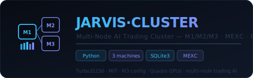

<div align="center">
  
  <br/><br/>

  [](LICENSE)
  [](#)
  [](#architecture)
  [](#trading)
  [](#hardware)

  <br/>
  <p><strong>Cluster multi-nœuds IA trading · M1/M2/M3 · MEXC Futures · Quadro GPUs · SQLite3 partagé</strong></p>
  <p><em>Infrastructure distribuée pour le trading algorithmique IA — 3 machines synchronisées, modèles LLM locaux, base partagée</em></p>
</div>

---

## Architecture

```
JARVIS·CLUSTER — Topologie réseau
────────────────────────────────────────────────────
  M1 (Master / Coordinateur)
  ├── Orchestration générale
  ├── Base SQLite3 commune (BASE-SQL3-COMMUNE)
  ├── API REST :8001 — endpoints trading
  ├── WS broker :9742 — messages inter-nœuds
  └── Telegram notifications

  M2 (LMT2 — LM Studio)
  ├── Inférence LLM lourde
  ├── qwen3-30b · deepseek-r1
  └── API OpenAI-compatible :1234

  M3 (Server — Quadro)
  ├── 45GB RAM · 3× Quadro GPU
  ├── Compute intensif (scan MEXC)
  ├── Backup SQLite3
  └── Résilience / failover
```

---

## Structure

```
JARVIS-CLUSTER/
├── README.md
├── main.py                 ← Orchestrateur cluster
├── requirements.txt
├── cluster/
│   ├── coordinator.py      ← M1 coordination
│   ├── node_m2.py          ← Interface M2 LM Studio
│   ├── node_m3.py          ← Interface M3 compute
│   └── sync.py             ← Synchronisation DB
├── trading/
│   ├── scanner.py          ← Scan MEXC multi-nœuds
│   ├── signals.py          ← Signaux distribués
│   └── executor.py         ← Exécution ordres
├── database/
│   ├── common_db.py        ← BASE-SQL3-COMMUNE
│   └── migrations/
├── monitoring/
│   ├── health.py           ← Health checks nœuds
│   └── gpu_monitor.py      ← GPU Quadro M3
└── config/
    └── nodes.yaml          ← Config IPs nœuds
```

---

## Configuration

```yaml
# config/nodes.yaml
nodes:
  m1:
    host: 192.168.1.10
    role: master
    ws_port: 9742
    api_port: 8001
  m2:
    host: 192.168.1.11
    role: llm
    lm_studio_port: 1234
  m3:
    host: 192.168.1.12
    role: compute
    quadro_gpus: 3
    ram_gb: 45
```

---

## Démarrage

```bash
# Sur M1 (master)
python main.py --node=m1 --role=master

# Sur M3 (compute)
python main.py --node=m3 --role=compute

# Health check cluster
python -c "from cluster import coordinator; coordinator.health_all()"
```

---

<div align="center">

**Franc Delmas (Turbo31150)** · [github.com/Turbo31150](https://github.com/Turbo31150) · Toulouse

*JARVIS·CLUSTER — Multi-Node AI Trading Cluster — MIT License*

</div>
